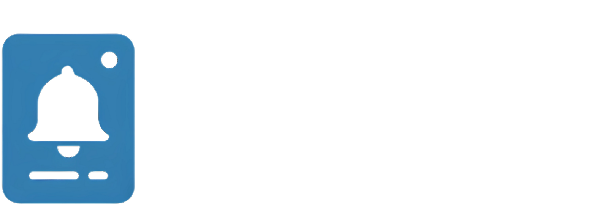

  
  

# 📄 Nome do Projeto: DocAlert v1.0

---

## 🩺 Nome Proposto

**DocAlert v1.0**

### 🔹 Justificativa
- **"Doc"**: Referência direta ao **DocHelp**, mantendo a identidade e associação com o sistema principal.
- **"Alert"**: Indica a principal funcionalidade do dispositivo: alertar médicos sobre novas mensagens ou chamadas de atenção.
- **"v1.0"**: Denota que esta é a primeira versão do dispositivo, permitindo futuras atualizações e versões aprimoradas.

---

## 🛠️ Características do **DocAlert v1.0**

- **Notificações em tempo real**: Recebe alertas do sistema DocHelp via AWS IoT Core.
- **Feedback físico**: Utiliza buzzer e LEDs para alertar o médico de forma audível e visual.
- **Configuração simplificada**: Provisionamento fácil de Wi-Fi e identificação do dispositivo.
- **Atualizações OTA**: Permite atualizações remotas de firmware para melhorias contínuas.

---

## 🎯 Benefícios

- **Integração direta**: Sincroniza perfeitamente com o fluxo de trabalho do DocHelp, garantindo que os médicos recebam alertas críticos sem depender exclusivamente de dispositivos móveis.
- **Aumento da eficiência**: Reduz o tempo de resposta dos médicos ao fornecer alertas imediatos e perceptíveis.
- **Personalização**: Possibilidade de adaptar o dispositivo às necessidades específicas de diferentes especialidades médicas.

---

# 📄 Documentação Oficial - Projeto de Notificação Física IoT (ESP32 + AWS IoT Core + n8n)

---

## 1. Visão Geral do Projeto

Desenvolver um sistema de notificação física utilizando ESP32 que:
- Se conecta à internet via Wi-Fi.
- Recebe mensagens via **AWS IoT Core MQTT**.
- Notifica usuários (clientes/médicos) por **buzzer** e **LEDs**.
- Permite **provisionamento fácil** de Wi-Fi e ID único para cada dispositivo.
- Permite **atualizações OTA (Over-The-Air)**.
- Integra com o sistema atual de notificações via fluxo n8n e Webhook.

---

## 2. Estrutura do Projeto

| Item | Tecnologia/Ferramenta | Objetivo |
|:----|:-----------------------|:---------|
| Hardware | ESP32, buzzer, LEDs, caixa 3D | Notificação física |
| Servidor MQTT | **AWS IoT Core** | Comunicação segura e escalável |
| Backend (n8n) | Webhook + Publicação MQTT | Integração com o sistema atual |
| Firmware | Arduino C++ (ESP32 SDK) | Programação do dispositivo |
| Atualização OTA | AWS IoT Jobs ou WebServer OTA | Atualizações remotas de firmware |
| Design 3D | Empresa especializada | Caixa plástica personalizada |

---

## 3. Planejamento e Etapas do Projeto

### 📚 3.1 Levantamento de Requisitos
- Definir formato da mensagem MQTT (payload JSON).
- Definir tópicos MQTT:
  - Por ID único: `clientes/{id_unico}/notificacoes`
  - Por grupo: `clientes/grupo/{nome_grupo}/notificacoes`
- Definir política de acesso no AWS IoT Core (certificados + políticas).
- Definir layout físico da caixa e componentes internos.

---

### 🏗️ 3.2 Implementação do Servidor MQTT (AWS IoT Core)

#### Etapas:
1. Configurar AWS IoT Core:
   - Criar **Thing** para cada ESP32.
   - Criar **certificados** para autenticação segura.
   - Anexar **política de permissão**:
     - Permitir `iot:Connect`, `iot:Subscribe`, `iot:Receive`, `iot:Publish` nos tópicos específicos.
2. Criar regras de tópicos:
   - Receber notificações para dispositivos ou grupos.
3. Definir estrutura de tópicos.
4. Gerar certificados para embarcar nos dispositivos.

#### Entregáveis:
- ARN do AWS IoT Core.
- Endereço MQTT (ex: `xxxxx-ats.iot.us-east-1.amazonaws.com`).
- Certificados para cada ESP32.

---

### 🔗 3.3 Criação do Webhook no n8n

#### Etapas:
1. Criar Webhook HTTP Node no n8n para receber POST:
   - Parâmetros obrigatórios: `secret_key`, `target_id`, `message`.
2. Validar `secret_key`.
3. Interpretar se `target_id` é ID único ou grupo.
4. Conectar ao **AWS IoT Core**:
   - Usar Node MQTT ou chamada API para publicar.
5. Publicar a mensagem no tópico correto.
6. Retornar resposta de sucesso/falha.

---

### ⚙️ 3.4 Firmware do ESP32

#### Funções Principais:
- Conectar à rede Wi-Fi (provisionada).
- Conectar ao AWS IoT Core utilizando:
  - Certificados privados embarcados.
  - MQTT seguro (TLS).
- Se inscrever nos tópicos corretos.
- Acionar buzzer e LED ao receber notificação.
- Provisionamento via Wi-Fi:
  - Se não configurado, criar rede Wi-Fi AP (`Notificador-Config`).
  - Página Web para configuração de Wi-Fi + ID único.
- Atualização OTA:
  - Via AWS IoT Jobs (preferencial) ou servidor OTA próprio.

---

### 🛠️ 3.5 Processo de Desenvolvimento da Caixa 3D

#### Etapas:
1. Definir layout interno para ESP32, buzzer e LEDs.
2. Esboçar modelo 3D inicial (Sketch ou CAD).
3. Entrar em contato com empresas especializadas:
   - Exemplos: 3D Proto, PrintCity, ou freelancers (Fiverr, Workana).
4. Solicitar protótipo físico.
5. Ajustar e validar protótipo com ESP32 real.
6. Produção final de múltiplas unidades.

---

## 4. Divisão de Atividades

| Fase | Tarefa | Responsável | Status |
|:----|:------|:------------|:------|
| Levantamento | Definir tópicos, mensagens, chaves | Time de engenharia | 🔲 |
| Infraestrutura | Configurar AWS IoT Core + políticas | DevOps AWS | 🔲 |
| Backend | Criar webhook e integração MQTT no n8n | Dev automação | 🔲 |
| Firmware | Programar ESP32 (Wi-Fi, MQTT, OTA, Provisionamento) | Desenvolvedor embarcado | 🔲 |
| Hardware | Comprar e montar componentes | Comprador | 🔲 |
| Design | Desenvolver e fabricar caixa 3D | Design 3D | 🔲 |
| Testes | Testes ponta-a-ponta (mqtt ➔ n8n ➔ ESP32) | QA | 🔲 |
| Implantação | Provisionamento e instalação dos dispositivos | Equipe de campo | 🔲 |

---

## 5. Considerações Técnicas

- Utilizar comunicação segura MQTT com **TLS**.
- Firmware ESP32 deve ser resiliente:
  - Reconexão automática Wi-Fi e MQTT.
  - Watchdog para recuperação de falhas.
- Provisionamento inicial fácil (AP Mode + Página Web).
- Atualização OTA assinada e segura.
- Logs locais básicos para troubleshooting.
- Monitoramento futuro com AWS IoT Shadows (opcional).

---

## 6. Futuras Melhorias

- Controle remoto de comandos via MQTT (ex: reset remoto).
- Dashboard para monitoramento de dispositivos conectados/desconectados.
- Sistema de alertas por desconexão via SNS ou e-mail.
- Implementação de comandos de "status" para feedback do aparelho.

---

# ✅ Resultado Esperado

Um ecossistema de **notificação física IoT**:
- **Seguro**, **escalável**, **atualizável** e **gerenciável**.
- Integrado com AWS IoT Core, ESP32 e sistema de notificações via n8n.
- Facilmente expansível para centenas de dispositivos.

---

# 📌 Próximos Passos

- Criar ambiente AWS IoT Core.
- Especificar formato do payload JSON para envio.
- Criar fluxo inicial no n8n.
- Prototipar ESP32 conectado ao AWS IoT Core.